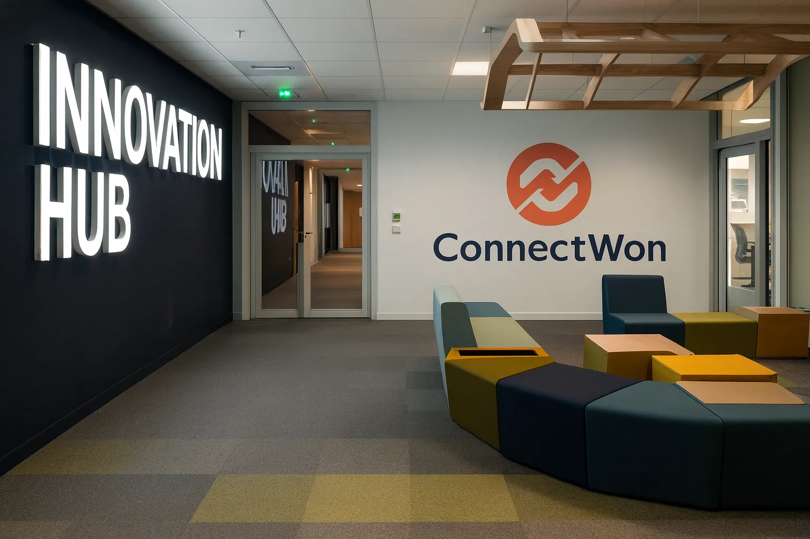
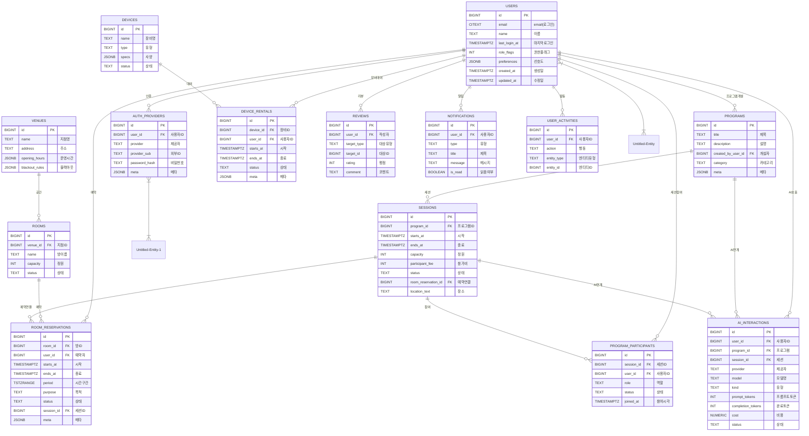

# 🚀 ConnectWon


## 📋 프로젝트 개요
> **도전하는 모든 이에게 공정한 기회와 지속되는 연결의 장을 제공한다.**



[](https://github.com/artiordex/kosa-mvp-connectwon/actions)
[](https://opensource.org/licenses/MIT)

> 본 프로젝트의 목표는 MVP를 신속하게 설계·구현하여 핵심 기능과 서비스 가치를 검증하고, 이를 기반으로 향후 확장 가능한 서비스 아키텍처와 비즈니스 모델을 구체화하는 것이다.
  이를 위해 기획, 설계, 개발, 테스트, 배포 전 과정을 단일 사이클 내에서 완성하며, 실사용 환경에서의 피드백을 반영할 수 있는 프로토타입을 제작한다.

- **📌 Project Name**: ConnectWon (커넥트원)
- **📖 Description**: ConnectWon은 취업 및 창업 준비자를 위한 예약 기반 생활 서비스 플랫폼입니다. 인큐베이터형 공유 오피스 예약, AI 기반 프로그램 매칭, 멘토링 네트워크를 통해 청년들의 성장과 도전을 지원합니다.
- **⏳ Duration**: 2025.09.05 - 2025.10.10 (6주)
- **👥 Team**: 아티올덱스(Artiordex) - 민시우, 소나무
- **🎓 Mentor**: 이영희 교수님 (KOSA)


## 📂 프로젝트 산출물 링크 모음

- [Notion](https://www.notion.so/your-link)
- [Google Drive](https://drive.google.com/drive/folders/your-id)
- [발표자료 PPT](https://docs.google.com/presentation/d/your-id)
- [GitHub Repo](https://github.com/artiordex/kosa-mvp-connectwon)
- [Figma](https://www.figma.com/file/your-id/your-project?type=design)
- [Mermaid ERD](https://mermaid.live/edit#pako:your-encoded-data)
- [Lucidchart](https://lucid.app/lucidchart/your-id/edit?viewport_loc=0%2C0%2C2000%2C2000)
- [Dev Docs](https://github.com/artiordex/kosa-mvp-connectwon/tree/main/docs)


## 🎯 핵심 가치

### 💼 비즈니스 모델

#### 🌐 하이브리드 커뮤니티 운영
- **공식 프로그램**: 플랫폼이 직접 기획 및 운영하는 창업 지원, 네트워킹, 교육 프로그램
- **회원 주도 프로그램**: 커뮤니티 회원이 자율적으로 제안하고 운영하는 워크숍, 세미나, 프로젝트
- **운영 철학**: 자율성과 연결성을 기반으로 한 커뮤니티 중심 플랫폼

#### 💰 수익 구조
- **멤버십 구독**: 월/연 단위 유료 멤버십 (혜택: 공간 할인, 프로그램 우선 참여, 포인트 지급 등)
- **공간 대여**: 회의실, 오피스, 이벤트 공간 시간 단위 대여
- **멘토링 서비스**: 전문가와의 1:1 또는 그룹 멘토링 유료 매칭
- **부가서비스**: 프린팅, 커피바, 창업 컨설팅, 법률/회계 지원 등

#### 🌱 사회적 가치
- **청년 창업 지원**: 저비용·고효율 공간과 네트워크 제공
- **지역 활성화**: 유휴 공간 활용 및 지역 커뮤니티 연계
- **지속 가능성**: 멤버십 기반 운영으로 안정적 수익 구조 확보


## 🧩 주요 기능 상세

### 🏢 공유 오피스 예약 시스템
**기능**:
- 실시간 공간 가용성 확인 (캘린더 기반 UI)
- 시간/공간 단위 예약 및 취소
- 예약 내역 관리 및 알림 연동 (Email, SMS, Push)
- 사용자 멤버십/권한에 따른 예약 정책 적용
- 관리자용 예약 현황 대시보드 및 통계
- n8n 기반 예약 확정/취소 알림 자동화

**기술 스택**:
- **Frontend**: Next.js 15 (App Router), React, Zustand, React Query, Tailwind CSS
- **Backend**: NestJS 11, Prisma ORM, ts-rest (타입 안전 API), BullMQ (비동기 작업 큐)
- **Infra & DB**: PostgreSQL 15, Redis 7 (Cache/Queue), Docker Compose, Kubernetes
- **Auth & Security**: Auth.js (Google/Naver/Kakao), JWT + Guard, Role-based Access Control
- **Automation & Notification**: n8n Workflow Engine, nodemailer, Slack Webhook
- **Monitoring**: Grafana, Prometheus, Sentry (에러/성능 추적)

### 🤖 AI 기반 서비스
**기능**:
- 사용자 행동 기반 프로그램 추천 (OpenAI Embedding + 벡터 검색)
- 콘텐츠 요약 및 자동 태깅 (GPT 기반 요약)
- 커뮤니티 모더레이션 (비속어 필터링, 토픽 분류)

**기술 스택**:
- OpenAI, Anthropic, Hugging Face API
- Zod 기반 데이터 검증
- BullMQ로 비동기 처리

### 💳 통합 결제 및 멤버십 관리
**기능**:
- Stripe 연동 결제 (카드, 포인트, 정기 구독)
- 포인트 적립/사용 내역 관리
- 멤버십 등급별 혜택 자동 적용

**기술 스택**:
- Stripe API
- Redis 기반 포인트 캐싱
- Prisma로 사용자-멤버십 관계 관리

### 📱 관리자 대시보드
**기능**:
- 실시간 사용자 통계 (가입자 수, 예약률, 프로그램 참여율)
- 사용자 관리 (권한, 멤버십, 활동 로그)
- 운영 분석 리포트 (월간/분기별 KPI 시각화)

**기술 스택**:
- Next.js + Recharts
- React Query + Zustand
- Backend API: NestJS + Swagger

### 🔔 자동화 알림 시스템
**기능**:
- 예약/취소/리마인더 알림 (Slack, 이메일, 앱 푸시)
- 관리자 알림 (공간 이상 감지, 멤버십 만료 등)
- 워크플로우 기반 예약 승인/거절 처리

**기술 스택**:
- n8n Workflow Engine
- Nodemailer, Slack Webhook
- BullMQ + Redis Queue


## 🛠️ 기술 스택

### 🧩 Core Technologies
| 항목              | 설명                                                                 |
|-------------------|----------------------------------------------------------------------|
| **Framework**     | **Next.js 15** (App Router, Server Actions), **NestJS 11**           |
| **Language**      | TypeScript 5.6, Node.js ≥ 20                                         |
| **Package Manager** | pnpm 10 (workspace + Nx 기반 모노레포)                              |
| **Architecture**  | Monorepo (Nx), Domain-Driven Design (DDD), Hexagonal/Ports & Adapters|
| **Build Tools**   | Nx, Vite, Webpack, tsx, ts-node                                      |

### 🎨 Frontend
| 항목         | 설명                                                                 |
|--------------|----------------------------------------------------------------------|
| **UI/Design**| Tailwind CSS, shadcn/ui, class-variance-authority, lucide-react, custom design tokens |
| **State Mgmt**| Zustand, TanStack React Query                                        |
| **Forms**    | react-hook-form                                                      |
| **Animations**| framer-motion                                                       |
| **Auth**     | Auth.js (next-auth providers: Google, Naver, Kakao)                  |
| **Charts**   | Recharts                                                             |
| **Icons**    | heroicons, react-icons                                               |
| **File Upload** | react-dropzone                                                    |
| **Color Picker** | react-color                                                     |

### 🧠 Backend & Database
| 항목               | 설명                                                                 |
|--------------------|----------------------------------------------------------------------|
| **Framework**       | NestJS 11 (모듈별 분리: auth, users, payments, reservations, venues, programs 등) |
| **Database**        | PostgreSQL 14+, Prisma ORM                                          |
| **Cache/Queue**     | Redis (ioredis), BullMQ + Bull Board                                |
| **API 설계**        | ts-rest, zod-openapi, Swagger UI                                    |
| **Validation**      | class-validator, zod, class-transformer                             |
| **Mailing**         | nodemailer (이메일 알림)                                            |
| **Security**        | bcryptjs, helmet, jsonwebtoken, cookie-session                      |

### 🤖 AI & External Services
| 항목             | 설명                                                                 |
|------------------|----------------------------------------------------------------------|
| **AI APIs**      | OpenAI SDK, Anthropic SDK, Hugging Face Inference API                |
| **Automation**   | n8n Workflow Engine (api 연결, webhooks, 예약/결제 알림)             |
| **Notifications**| Slack Webhook, Email (nodemailer), Push (웹/앱 푸시 예정)            |
| **Payment**      | Stripe (결제, 구독/포인트/정산 모듈 준비)                            |

### 🚀 DevOps & Infra
| 항목           | 설명                                                                 |
|----------------|----------------------------------------------------------------------|
| **Deployment** | Docker + Docker Compose, Kubernetes (ArgoCD, Kustomize), Vercel (FE) |
| **CI/CD**      | GitHub Actions, Husky + lint-staged                                   |
| **Monitoring** | Grafana, Prometheus, Alerts, Sentry, Vercel Analytics                |
| **Logging**    | winston, logform, pino, daily rotate file                             |

### 🧪 Testing & Quality
| 항목           | 설명                                                                 |
|----------------|----------------------------------------------------------------------|
| **Unit Test**  | Vitest, @vitest/ui                                                   |
| **E2E Test**   | Playwright                                                           |
| **Mocking**    | MSW (Mock Service Worker)                                            |
| **API Test**   | supertest                                                            |
| **Lint & Style**| ESLint, Prettier, typescript-eslint, prettier-plugin-tailwindcss     |
| **Commit 관리**| Changesets, Commitizen, cz-customizable, husky pre-commit hooks       |
| **Static Check**| knip (unused code), syncpack (dependency sync)                      |

### 📦 주요 내부 패키지

| 패키지명             | 역할 및 의존성 요약                                               |
|----------------------|-------------------------------------------------------------------|
| **@connectwon/core** | 도메인 로직, BullMQ, Redis, AI API 연동, 인증/메일 등             |
| **@connectwon/database** | Prisma ORM, PostgreSQL, dotenv 연동                         |
| **@connectwon/logger** | winston 기반 로깅 시스템                                        |
| **@connectwon/api-contract** | zod 기반 API 스펙, ts-rest 연동                        |
| **@connectwon/sdk**  | 백엔드(NestJS)에서 사용하는 타입 안전 API 호출 SDK(Python + Typescript) |
| **@connectwon/ui**   | 공통 UI 컴포넌트, Tailwind 기반 디자인 시스템                     |
| **@connectwon/server** | SSR 관련 서버 컴포넌트, React Query, Nodemailer 등             |
| **@connectwon/web**  | 메인 프론트엔드 앱, next-auth, react-hook-form 등                |
| **@connectwon/admin**| 관리자 페이지, Auth.js 기반 인증                                 |
| **@connectwon/api**  | NestJS 기반 API 서버, Swagger 문서화, BullMQ 연동                |
| **@connectwon/worker** | Bull Board UI, 백그라운드 작업 처리                            |
| **@connectwon/e2e**  | Playwright 기반 E2E 테스트                                        |
| **@connectwon/n8n**  | n8n 자동화 워크플로우 관리                                        |


## 🏗️ 프로젝트 구조

```
kosa-mvp-connectwon/
├── apps/
│ ├── admin/
│ ├── api/
│ ├── e2e/
│ ├── web/
│ └── worker/
│
├── packages/
│ ├── api-contract/
│ │ └── src/
│ │ ├── client.ts
│ │ ├── contracts/
│ │ ├── openapi/
│ │ └── schemas/
│ ├── client/
│ │ └── src/
│ │ ├── hooks/
│ │ └── providers/
│ ├── configs/
│ │ ├── eslint/
│ │ ├── tailwind/
│ │ ├── testing/
│ │ └── typescript/
│ ├── core/
│ │ └── src/
│ │ ├── adapters/
│ │ │ ├── ai/
│ │ │ └── notification/
│ │ ├── application/
│ │ │ ├── application.module.ts
│ │ │ ├── guards/
│ │ │ ├── policies/
│ │ │ └── usecases/
│ │ ├── domain/
│ │ ├── infrastructure/
│ │ ├── ports/
│ │ └── queue/
│ ├── database/
│ │ └── prisma/
│ ├── logger/
│ ├── sdk/
│ ├── server/
│ │ └── src/
│ │ ├── decorators/
│ │ ├── guards/
│ │ ├── interceptors/
│ │ ├── middleware/
│ │ ├── pipes/
│ │ ├── plugins/
│ │ └── rsc-cache.ts
│ └── ui/
│ ├── public/
│ │ ├── favicon/
│ │ ├── fonts/
│ │ ├── icons/
│ │ └── images/
│ └── src/
│ ├── animations/
│ ├── charts/
│ ├── components/
│ ├── hooks/
│ ├── layout/
│ ├── public/
│ ├── styles/
│ ├── utils/
│ └── templates/
├── infra/
│ ├── database/
│ ├── docker/
│ ├── infra-types.ts
│ ├── k8s/
│ ├── monitoring/
│ └── n8n/
├── docs/
│ ├── guideline/
│ └── study/
├── tools/
│ ├── services/
│ ├── testkit/
│ └── utils/
├── test/
├── tmp/
├── .husky/
├── .changeset/
├── .cz-config.cjs
├── .dockerignore
├── .eslintignore
├── .eslintrc.json
├── .hintrc
├── .pnpmrc
├── .prettierrc.json
├── connectwon-env.ts
├── LICENSE
├── nx.json
├── package.json
├── pnpm-lock.yaml
├── pnpm-workspace.yaml
├── PROJECT-ARCH.md
├── README.md
├── renovate.json
├── setup-structure.ps1
├── tsconfig.base.json
├── tsconfig.json
└── vitest.config.ts
```

## 🛢️DDL


## 📦 필수 설치 항목

### 🧰 시스템 도구

| 항목                  | 최소 버전  | 설치 방법 |
|-----------------------|------------|-----------|
| **Node.js**           | 20+        | [nodejs.org](https://nodejs.org) 또는 `nvm` 사용 |
| **pnpm**              | 10+        | `npm install -g pnpm` |
| **Git**               | 최신       | [git-scm.com](https://git-scm.com) |
| **Docker**            | 최신       | [Docker Desktop](https://www.docker.com/products/docker-desktop) |
| **docker compose**    | v2 (내장)  | Docker Desktop에 포함됨 |
| **VS Code**           | 최신       | [code.visualstudio.com](https://code.visualstudio.com) |
| **터미널 환경**        | 최신       | Windows Terminal, zsh, bash 등 |

### 🗄️ 백엔드 서비스 (Docker 기반)

| 서비스          | 권장 버전 | 실행 방법 |
|-----------------|-----------|-----------|
| **PostgreSQL**  | 15+       | `docker compose -f infra/docker/docker-compose.yml up -d postgres` |
| **Redis**       | 7+        | `docker compose -f infra/docker/docker-compose.yml up -d redis` |
> infra/docker/docker-compose.yml 파일을 기반으로 실행됩니다.

### ⚙️ 개발 환경 설정 권장 사항

**VS Code 확장 추천**:
- ESLint
- Prettier
- Tailwind CSS IntelliSense
- Prisma
- GitLens
- DotENV

**터미널 환경**:
- Windows: PowerShell 또는 Windows Terminal
- macOS/Linux: zsh 또는 bash


## 🚀 설치 및 실행 가이드

### 1️⃣ 저장소 클론

```bash
git clone https://github.com/your-username/kosa-mvp-connectwon.git
cd kosa-mvp-connectwon
```
---
### 2️⃣ 필수 도구 설치

| 도구             | 최소 버전 | 설치 방법 |
|------------------|-----------|-----------|
| Node.js          | 20+       | [nodejs.org](https://nodejs.org) 또는 `nvm` 사용 |
| pnpm             | 10+       | `npm install -g pnpm` |
| Git              | 최신      | [git-scm.com](https://git-scm.com) |
| Docker & Compose | 최신(v2)  | [Docker Desktop](https://www.docker.com/products/docker-desktop) |
| VS Code          | 최신      | [code.visualstudio.com](https://code.visualstudio.com) |

> 💡 **VS Code 확장 추천**
> - **Nx Console** (Nx 워크스페이스 관리)
> - **ESLint** + **Prettier** (코드 스타일 & 린팅)
> - **Tailwind CSS IntelliSense** (유틸리티 클래스 자동완성)
> - **Prisma** (DB 스키마 관리)
> - **DotENV** (환경변수 지원)
> - **GitLens** (깊이 있는 Git 히스토리 탐색)
> - **Error Lens** (코드 에러/워닝 인라인 표시)
> - **REST Client** 또는 **Thunder Client** (API 테스트)
---
### 3️⃣ 의존성 설치

```bash
# 의존성 설치
pnpm install
# 의존성 그래프 확인
pnpm nx graph
```
> 모든 앱과 패키지의 의존성이 설치됩니다. 모노레포 기반이므로 루트에서 한 번만 실행하면 됩니다.
---

### 4️⃣ 환경 변수 설정

```bash
cp .env.example .env
```

- `.env.example` 파일을 열어 다음과 같은 환경변수를 설정합니다:
  - `DATABASE_URL=postgresql://...`
  - `REDIS_URL=redis://...`
  - `NEXTAUTH_SECRET=...`
  - `STRIPE_SECRET_KEY=...`
  - 기타 서비스 키 (OpenAI, Hugging Face 등)

> 💡 `connectwon-env.ts` 파일도 참고하면 환경 변수 타입 정의를 확인할 수 있습니다.

---

### 5️⃣ 도커 기반 서비스 실행

```bash
docker compose -p connectwon --env-file .env -f infra/docker/docker-compose.yml up -d
```
- 도커 설정은 `infra/docker/docker-compose.yml`에 정의되어 있습니다.
- 실행 후 `localhost:5432`, `localhost:6379` 포트로 접근 가능합니다.

---

### 6️⃣ 개발 서버 실행

#### 전체 앱 실행

```bash
pnpm dev:all
```

> 모든 앱(admin, web, api, worker)이 병렬로 실행됩니다.

#### 개별 앱 실행

```bash
pnpm dev:web     # 사용자 웹 앱 (Next.js)
pnpm dev:admin   # 관리자 웹 앱
pnpm dev:api     # 백엔드 API 서버 (NestJS)
pnpm dev:worker  # 백그라운드 작업 처리 (BullMQ)
```

> 각 앱은 `apps/` 디렉토리 하위에 위치하며, 독립적으로 실행 가능합니다.

---


### 7️⃣ 스크립트 실행 (bash 기준)

```bash
# OpenAPI 스키마 생성
pnpm --filter @connectwon/api-contract generate

# 클라이언트 빌드
pnpm --filter @connectwon/api-contract build

# SDK 훅/프로바이더 빌드
pnpm --filter @connectwon/client build

# 개발 모드 (watch)
pnpm --filter @connectwon/client dev

# eslint / tailwind / tsconfig 등 공유 설정 빌드
pnpm --filter @connectwon/configs build

# 도메인 / 애플리케이션 레이어 빌드
pnpm --filter @connectwon/core build

# 테스트 실행
pnpm --filter @connectwon/core test

# Prisma 클라이언트 생성
pnpm --filter @connectwon/database prisma generate

# 마이그레이션 실행
pnpm --filter @connectwon/database prisma migrate dev

# DB 시드
pnpm --filter @connectwon/database prisma db seed

# 특정 패키지만 실행 (예: api)
pnpm --filter @connectwon/api build

# 특정 앱 실행 (예: web, api, admin, worker)
pnpm nx serve @connectwon/web
pnpm nx serve @connectwon/api
pnpm nx serve @connectwon/admin
pnpm nx serve @connectwon/worker

# 특정 프로젝트 빌드
pnpm nx build @connectwon/api

# 다중 프로젝트 빌드 (병렬)
pnpm nx run-many -t build --parallel

# 테스트 실행
pnpm nx run-many -t test --parallel

# BullMQ 대기열 작업 실행 (worker)
pnpm nx serve @connectwon/worker

# Bull Board (웹 UI) 실행 — 패키지에 따라 연결 필요
pnpm nx run @connectwon/api:bull-board

# Redis 연결 확인 (CLI)
docker exec -it connectwon-redis redis-cli

#### 유닛 테스트 (Vitest)

```bash
pnpm test
```

#### E2E 테스트 (Playwright)

```bash
pnpm e2e
```

> 테스트 설정은 `apps/e2e` 및 `vitest.config.ts`에 정의되어 있습니다.

## 🎨 주요 화면

### 사용자 앱 (Web)

- **홈페이지**: 서비스 소개 및 주요 기능
- **프로그램 목록**: AI 추천 기반 프로그램 탐색
- **예약 시스템**: 실시간 캘린더 기반 예약
- **마이페이지**: 예약 내역, 포인트 관리, 프로필

### 관리자 앱 (Admin)

- **대시보드**: 실시간 통계 및 주요 지표
- **사용자 관리**: 회원 정보 및 멤버십 관리
- **공간 관리**: 지점/룸 관리 및 가용성 설정
- **프로그램 관리**: 프로그램/세션 관리

## 🔍 벤치마킹 및 참고 자료

프로젝트 개발에 참고한 주요 서비스들:

#### 공간 예약 플랫폼

- **[Shareit](https://www.shareit.kr)**: 소규모 공간 예약 모델, 검색 필터 및 카테고리 UX
- **[SpaceCloud](https://spacecloud.kr)**: 프로그램 모집, 검색 필터, 카테고리 구조

#### 코워킹 스페이스

- **[WeWork](https://www.wework.com/ko-KR)**: 글로벌 코워킹 운영 및 커뮤니티 라운지 모델
- **[SparkPlus](https://sparkplus.co)**: 국내 지점 운영 및 스타트업 중심 이벤트
- **[FastFive](https://www.fastfive.co.kr)**: 스타트업 중심 코워킹 환경
- **[Industrious](https://www.industriousoffice.com)**: 프리미엄 오피스 및 호스피털리티 중심 생산성 공간

#### 스타트업 지원형 공간

- **[DreamPlus](https://www.dreamplus.io)**: 스타트업 지원형 공간 및 프로그램 연계
- **[Orange Planet](https://orangeplanet.or.kr/)**: 창업 커뮤니티 및 지원 프로그램 통합
- **[ICT CoC](https://ictcoc.kr/)**: ICT SW 프로그램 및 공간제공

#### 공공/커뮤니티 서비스

- **[서울청년포털](https://youth.seoul.go.kr)**: 공공 청년 라운지 및 정책 연계
- **[스마트플레이스](https://www.smartplace.kr)**: 리뷰 기반 O2O 운영 모델

#### 가치혁신 및 커뮤니티

- **[Impact Hub](https://www.impacthub.net)**: 기업/공공/스타트업/투자자 간 협력 플랫폼
- **[MOSF 블로그](https://blog.mosf.kr)**: 공간 플랫폼 기획 및 공간의 의미 탐구

### 💡 차별화 포인트

위 서비스들과 차별화되는 ConnectWon만의 특징:

- **하이브리드 커뮤니티**: 공식 프로그램 + 회원 주도 프로그램 공존
- **AI 기반 개인화**: OpenAI/Anthropic을 활용한 프로그램 매칭 및 콘텐츠 생성
- **사회적 가치 중심**: 취창업 준비자 특화 저비용 고효율 서비스
- **통합 자동화**: n8n 기반 예약부터 결제, 알림까지 end-to-end 자동화

### 🔧 참고자료

#### 언어 & 프레임워크
- [Next.js](https://nextjs.org/docs)
- [NestJS](https://docs.nestjs.com/)
- [TypeScript](https://www.typescriptlang.org/docs/)
- [React](https://react.dev/learn)
- [Node.js](https://nodejs.org/en/docs)

#### 인증 & 보안
- [Auth.js (NextAuth)](https://authjs.dev/)
- [jsonwebtoken](https://github.com/auth0/node-jsonwebtoken#readme)
- [bcryptjs](https://github.com/dcodeIO/bcrypt.js#readme)
- [helmet](https://helmetjs.github.io/)

#### 데이터베이스 & ORM
- [Prisma](https://www.prisma.io/docs)
- [@prisma/client](https://www.prisma.io/docs/reference/api-reference/prisma-client-reference)
- [class-validator](https://github.com/typestack/class-validator#readme)
- [class-transformer](https://github.com/typestack/class-transformer#readme)
- [Zod](https://zod.dev/)
- [zod-openapi](https://www.npmjs.com/package/zod-openapi)

#### API & 문서화
- [ts-rest](https://ts-rest.com/)
- [Swagger UI Express](https://github.com/scottie1984/swagger-ui-express#readme)
- [@nestjs/swagger](https://docs.nestjs.com/openapi/introduction)
- [OpenAPI Spec](https://github.com/OAI/OpenAPI-Specification)

#### 메시징 & 큐
- [BullMQ](https://docs.bullmq.io/)
- [@nestjs/bullmq](https://docs.nestjs.com/techniques/queues)
- [ioredis](https://github.com/redis/ioredis#readme)
- [@bull-board/ui](https://github.com/felixmosh/bull-board#readme)

#### 테스트 & 품질
- [Playwright](https://playwright.dev/)
- [Vitest](https://vitest.dev/)
- [Testing Library - React](https://testing-library.com/docs/react-testing-library/intro/)
- [MSW(Mock Service Worker)](https://mswjs.io/)
- [Supertest](https://github.com/ladjs/supertest#readme)
- [Testcontainers](https://testcontainers.com/)
- [jest-mock-extended](https://github.com/marchaos/jest-mock-extended)

#### 상태관리 & 데이터 패칭
- [TanStack Query (React Query)](https://tanstack.com/query/latest)
- [Zustand](https://zustand-demo.pmnd.rs/)
- [RxJS](https://rxjs.dev/)
- [superjson](https://github.com/blitz-js/superjson)

#### UI & 스타일링
- [Tailwind CSS](https://tailwindcss.com/docs)
- [PostCSS](https://postcss.org/docs/)
- [Autoprefixer](https://github.com/postcss/autoprefixer#readme)
- [Framer Motion](https://www.framer.com/motion/)
- [React Hook Form](https://react-hook-form.com/)
- [React Dropzone](https://react-dropzone.js.org/)
- [React Color](https://casesandberg.github.io/react-color/)
- [Heroicons](https://heroicons.com/)
- [Lucide React](https://lucide.dev/guide/packages/lucide-react)
- [Recharts](https://recharts.org/)
- [Class Variance Authority](https://cva.style/docs)
- [Tailwind Merge](https://www.npmjs.com/package/tailwind-merge)
- [Fontsource Inter](https://fontsource.org/fonts/inter)
- [Fontsource Poppins](https://fontsource.org/fonts/poppins)
- [React Icons](https://react-icons.github.io/react-icons/)

#### 로깅 & 모니터링
- [Winston](https://github.com/winstonjs/winston#readme)
- [winston-daily-rotate-file](https://www.npmjs.com/package/winston-daily-rotate-file)
- [Morgan](https://github.com/expressjs/morgan#readme)
- [Pino](https://getpino.io/#/)
- [Sentry](https://docs.sentry.io/platforms/javascript/)
- [Grafana](https://grafana.com/docs/)
- [Prometheus](https://prometheus.io/docs/introduction/overview/)

#### 서버 & 네트워크
- [Express](https://expressjs.com/)
- [CORS](https://github.com/expressjs/cors#readme)
- [dotenv](https://github.com/motdotla/dotenv#readme)
- [dotenv-cli](https://github.com/entropitor/dotenv-cli#readme)
- [Reflect Metadata](https://rbuckton.github.io/reflect-metadata/)
- [Fastify](https://fastify.dev/)
- [NestJS WebSockets](https://docs.nestjs.com/websockets/gateways)

#### 빌드 & 번들링
- [Vite](https://vitejs.dev/)
- [Webpack](https://webpack.js.org/)
- [Nx](https://nx.dev/)
- [ts-node](https://typestrong.org/ts-node/)
- [tsx](https://github.com/esbuild-kit/tsx#readme)

#### 코드 품질 & 린팅
- [ESLint](https://eslint.org/docs/latest/)
- [Prettier](https://prettier.io/docs/en/)
- [eslint-config-next](https://nextjs.org/docs/basic-features/eslint)
- [eslint-config-prettier](https://github.com/prettier/eslint-config-prettier#readme)
- [eslint-plugin-import](https://github.com/import-js/eslint-plugin-import#readme)
- [eslint-plugin-prettier](https://github.com/prettier/eslint-plugin-prettier#readme)
- [eslint-plugin-simple-import-sort](https://github.com/lydell/eslint-plugin-simple-import-sort#readme)
- [eslint-plugin-unused-imports](https://github.com/sweepline/eslint-plugin-unused-imports#readme)
- [knip](https://knip.dev/)
- [syncpack](https://github.com/JamieMason/syncpack#readme)

#### 자동화 & 배포
- [Husky](https://typicode.github.io/husky/)
- [Lint-Staged](https://github.com/okonet/lint-staged#readme)
- [Renovate](https://docs.renovatebot.com/)
- [Changesets](https://github.com/changesets/changesets#readme)
- [Commitizen](https://commitizen-tools.github.io/commitizen/)
- [cz-customizable](https://github.com/leoforfree/cz-customizable#readme)
- [npm-run-all](https://github.com/mysticatea/npm-run-all#readme)
- [Concurrently](https://github.com/open-cli-tools/concurrently#readme)
- [Plop.js](https://plopjs.com/)
- [zx](https://github.com/google/zx)

#### AI & 외부 API
- [OpenAI Node SDK](https://github.com/openai/openai-node#readme)
- [Anthropic AI SDK](https://github.com/anthropics/anthropic-sdk-typescript#readme)
- [Hugging Face Inference API](https://huggingface.co/docs/api-inference/index)
- [Stripe API](https://stripe.com/docs/api)
- [Public API 정리](https://github.com/yybmion/public-apis-4Kr)

#### 워크플로우 자동화
- [n8n](https://n8n.io/docs)
- [ArgoCD](https://argo-cd.readthedocs.io/en/stable/)

#### 기타 유틸리티
- [Day.js](https://day.js.org/)
- [clsx](https://github.com/lukeed/clsx#readme)
- [js-yaml](https://github.com/nodeca/js-yaml#readme)
- [rimraf](https://github.com/isaacs/rimraf#readme)


## 📌 MVP 개발 일정 (6주)

#### Week 1-2: 기획 및 기반 구축

**1. 비즈니스 모델 검증**
- 타겟 고객 페르소나 정의 및 주요 시나리오 도출
- 경쟁 서비스 벤치마킹(국내·외 예약 플랫폼, 공유오피스, 멘토링 서비스)
- 수익 모델 및 확장성 분석 (멤버십, 공간 대여, 부가 서비스)
- 예약·취소·환불·노쇼 정책 초안 수립

**2. 인프라 및 개발 환경 구축**
- Vercel 기반 프론트/백엔드 통합 배포 환경 세팅
- Supabase/Neon PostgreSQL DB 인스턴스 생성 및 연결
- Docker/Compose 표준화, GitHub Actions CI/CD 파이프라인 구성
- 환경 분리(dev/staging/prod) 및 GitHub Environments 기반 시크릿 관리
- Redis 설치 및 세션/캐시/대기열 처리 구조 마련
- Sentry, Vercel Analytics, pino 로깅 등 모니터링 툴 연동

**3. ERD 설계 및 DB 구축**
- 서비스 핵심 테이블(users, venues, rooms, programs, sessions, reservations, payments, ai_interactions) 설계
- Prisma 스키마 정의 및 마이그레이션 실행
- 초기 시딩 데이터 생성(지점, 회원, 프로그램, 예약, 결제 샘플)
- 인덱스 전략 수립(FK, 시간대별 조회, 예약 중복 방지)

**4. 기본 UI/UX 설계**
- IA(Information Architecture) 및 사용자 플로우 작성
- Figma를 활용한 웹/모바일 와이어프레임 제작
- 예약 캘린더, 결제 플로우, 로그인 화면 등 핵심 화면 시안
- 에러·예외 UX 설계(슬롯 충돌, 결제 실패, 취소 처리)

**5. 프로젝트 아키텍처 구성**
- Monorepo(Nx) 기반 프로젝트 구조 생성
- Next.js 14(App Router, Server Actions) + TypeScript 초기 세팅
- 공통 컴포넌트/레이아웃/스타일 시스템(Tailwind CSS, shadcn/ui) 구축
- API 명세서(zod-openapi) 초안 작성

#### Week 3-4: 핵심 기능 개발

**1. 사용자 인증 시스템**
- Auth.js 기반 소셜 로그인(Google/Naver/Kakao)
- JWT + 세션 하이브리드 인증 구조
- 권한(Role) 기반 접근 제어(User/Creator/Admin)
- 프로필 관리 및 예약 내역 조회 기능

**2. 예약 시스템 구현**
- FullCalendar 기반 예약 UI
- 가용 슬롯 계산, 동시성 제어, 중복·이중 예약 방지 로직
- 예약 정책(최소/최대 시간, 마감, 블랙아웃) 적용
- 대기열 엔진 구현(취소 시 자동 할당)

**3. 결제 시스템 연동**
- Stripe 결제 플로우 구현(카드 결제, 구독 결제)
- 환불/취소 처리 로직
- 결제 내역 관리 및 이메일 영수증 발송

**4. AI 서비스 통합**
- OpenAI API 연동(프로그램 요약, 태깅)
- Anthropic/Hugging Face API PoC(모더레이션, 분석)
- AI 호출 로그(ai_interactions) 저장 및 추천 알고리즘 기초 구현

#### Week 5-6: 완성 및 최적화

**1. 관리자 대시보드**
- 사용자/공간/프로그램/세션/예약 CRUD
- 통계 시각화(예약 수, 매출, 가동률, 노쇼율)
- 실시간 모니터링 및 알림

**2. 자동화 시스템 구축**
- n8n 워크플로우 구성(예약/변경/취소/환불 알림)
- 후기 요청, 미이용 리마인더, 정산 리포트 자동 발송
- 야간 배치 작업(만료 예약 정리)

**3. 테스트 및 QA**
- Vitest 단위 테스트(핵심 API)
- Playwright E2E 테스트(예약→결제→알림 플로우)
- 사용자 시나리오 기반 QA 및 버그 수정

**4. 성능 최적화**
- DB 인덱스 최적화 및 Redis 캐시 적용
- 이미지 최적화 및 CDN 적용
- 코드 스플리팅, 불필요 렌더링 최소화
- 보안 강화(zod 검증, 환경변수 키 관리, 로그 마스킹)

## 📞 문의

- **총괄개발**: 민시우 - [artiordex@gmail.com](mailto:artiordex@gmail.com)
- **총괄기획**: 소나무 - [snmaterial13@naver.com](mailto:snmaterial13@naver.com)

```
agape-care
├─ .changeset
│  ├─ config.json
│  └─ README.md
├─ .cz-config.cjs
├─ .firebaserc
├─ .hintrc
├─ .husky
│  └─ _
│     ├─ applypatch-msg
│     ├─ commit-msg
│     ├─ h
│     ├─ husky.sh
│     ├─ post-applypatch
│     ├─ post-commit
│     ├─ post-merge
│     ├─ post-rewrite
│     ├─ pre-applypatch
│     ├─ pre-auto-gc
│     ├─ pre-commit
│     ├─ pre-merge-commit
│     ├─ pre-push
│     ├─ pre-rebase
│     └─ prepare-commit-msg
├─ .pnpmrc
├─ apps
│  ├─ admin
│  │  ├─ next-env.d.ts
│  │  ├─ next.config.mjs
│  │  ├─ package.json
│  │  ├─ postcss.config.mjs
│  │  ├─ project.json
│  │  ├─ public
│  │  │  ├─ favicon
│  │  │  │  ├─ android-chrome-192x192.png
│  │  │  │  ├─ android-chrome-512x512.png
│  │  │  │  ├─ apple-touch-icon.png
│  │  │  │  ├─ favicon-16x16.png
│  │  │  │  ├─ favicon-32x32.png
│  │  │  │  ├─ favicon.ico
│  │  │  │  └─ site.webmanifest
│  │  │  └─ images
│  │  │     ├─ avatar.png
│  │  │     ├─ footer_logo.png
│  │  │     ├─ header_logo.png
│  │  │     ├─ logo.png
│  │  │     ├─ venue_sp_1.jpg
│  │  │     ├─ venue_sp_2.jpg
│  │  │     └─ venue_sp_3.jpg
│  │  ├─ server.ts
│  │  ├─ src
│  │  │  ├─ app
│  │  │  │  ├─ (auth)
│  │  │  │  │  └─ login
│  │  │  │  │     └─ page.tsx
│  │  │  │  ├─ (protected)
│  │  │  │  │  ├─ board
│  │  │  │  │  │  ├─ BoardManagement.tsx
│  │  │  │  │  │  ├─ ContentCreation.tsx
│  │  │  │  │  │  └─ page.tsx
│  │  │  │  │  ├─ dashboard
│  │  │  │  │  │  ├─ AiDashboard.tsx
│  │  │  │  │  │  ├─ AnalyticsDashboard.tsx
│  │  │  │  │  │  └─ page.tsx
│  │  │  │  │  ├─ facilities
│  │  │  │  │  │  ├─ equipments
│  │  │  │  │  │  │  ├─ add
│  │  │  │  │  │  │  │  ├─ EquipmentAddForm.tsx
│  │  │  │  │  │  │  │  └─ page.tsx
│  │  │  │  │  │  │  ├─ Equipment.tsx
│  │  │  │  │  │  │  ├─ page.tsx
│  │  │  │  │  │  │  └─ [id]
│  │  │  │  │  │  │     ├─ edit
│  │  │  │  │  │  │     │  ├─ EquipmentEditForm.tsx
│  │  │  │  │  │  │     │  └─ page.tsx
│  │  │  │  │  │  │     └─ EquipmentDetail.tsx
│  │  │  │  │  │  ├─ page.tsx
│  │  │  │  │  │  ├─ rooms
│  │  │  │  │  │  │  ├─ add
│  │  │  │  │  │  │  │  ├─ page.tsx
│  │  │  │  │  │  │  │  └─ RoomAddForm.tsx
│  │  │  │  │  │  │  ├─ page.tsx
│  │  │  │  │  │  │  ├─ Room.tsx
│  │  │  │  │  │  │  └─ [id]
│  │  │  │  │  │  │     ├─ edit
│  │  │  │  │  │  │     │  ├─ page.tsx
│  │  │  │  │  │  │     │  └─ RoomEditForm.tsx
│  │  │  │  │  │  │     ├─ page.tsx
│  │  │  │  │  │  │     └─ RoomDetail.tsx
│  │  │  │  │  │  └─ venues
│  │  │  │  │  │     ├─ add
│  │  │  │  │  │     │  ├─ page.tsx
│  │  │  │  │  │     │  └─ VenueAddForm.tsx
│  │  │  │  │  │     ├─ page.tsx
│  │  │  │  │  │     ├─ Venue.tsx
│  │  │  │  │  │     └─ [id]
│  │  │  │  │  │        ├─ edit
│  │  │  │  │  │        │  ├─ page.tsx
│  │  │  │  │  │        │  └─ VenueEditForm.tsx
│  │  │  │  │  │        ├─ page.tsx
│  │  │  │  │  │        └─ VenueDetail.tsx
│  │  │  │  │  ├─ feedback
│  │  │  │  │  │  └─ Feedback.tsx
│  │  │  │  │  ├─ help
│  │  │  │  │  │  └─ page.tsx
│  │  │  │  │  ├─ profile
│  │  │  │  │  │  ├─ edit
│  │  │  │  │  │  │  └─ page.tsx
│  │  │  │  │  │  └─ page.tsx
│  │  │  │  │  ├─ programs
│  │  │  │  │  │  ├─ add
│  │  │  │  │  │  │  ├─ page.tsx
│  │  │  │  │  │  │  └─ Post.tsx
│  │  │  │  │  │  ├─ OfflineProgram.tsx
│  │  │  │  │  │  ├─ OnlineProgram.tsx
│  │  │  │  │  │  ├─ page.tsx
│  │  │  │  │  │  └─ [id]
│  │  │  │  │  │     ├─ edit
│  │  │  │  │  │     │  └─ page.tsx
│  │  │  │  │  │     └─ sessions
│  │  │  │  │  │        └─ page.tsx
│  │  │  │  │  ├─ reservations
│  │  │  │  │  │  ├─ page.tsx
│  │  │  │  │  │  ├─ ProgramReservation.tsx
│  │  │  │  │  │  ├─ Reservation.tsx
│  │  │  │  │  │  ├─ Scheduler.tsx
│  │  │  │  │  │  └─ SpaceReservation.tsx
│  │  │  │  │  ├─ settings
│  │  │  │  │  │  ├─ Contact.tsx
│  │  │  │  │  │  └─ page.tsx
│  │  │  │  │  └─ users
│  │  │  │  │     ├─ page.tsx
│  │  │  │  │     └─ UserSettings.tsx
│  │  │  │  ├─ (public)
│  │  │  │  │  └─ page.tsx
│  │  │  │  ├─ api
│  │  │  │  │  ├─ auth
│  │  │  │  │  ├─ proxy
│  │  │  │  │  │  └─ [...path]
│  │  │  │  │  └─ webhooks
│  │  │  │  │     └─ stripe
│  │  │  │  ├─ error.tsx
│  │  │  │  ├─ globals.css
│  │  │  │  ├─ lib
│  │  │  │  ├─ loading.tsx
│  │  │  │  ├─ not-found.tsx
│  │  │  │  ├─ reservation
│  │  │  │  │  └─ [id]
│  │  │  │  ├─ test-firebase
│  │  │  │  │  └─ page.tsx
│  │  │  │  ├─ users
│  │  │  │  │  └─ [id]
│  │  │  │  │     └─ edit
│  │  │  │  └─ venues
│  │  │  │     └─ [id]
│  │  │  │        └─ edit
│  │  │  ├─ components
│  │  │  │  ├─ ai
│  │  │  │  │  ├─ AutomationTasks.tsx
│  │  │  │  │  ├─ PredictionAnalysis.tsx
│  │  │  │  │  ├─ SentimentAnalysis.tsx
│  │  │  │  │  └─ TimeSlotEfficiency.tsx
│  │  │  │  ├─ AppShell.tsx
│  │  │  │  ├─ Header.tsx
│  │  │  │  ├─ n8n
│  │  │  │  │  ├─ ApiConnections.tsx
│  │  │  │  │  ├─ AutomationTriggers.tsx
│  │  │  │  │  ├─ NotificationCenter.tsx
│  │  │  │  │  ├─ SlackIntegration.tsx
│  │  │  │  │  ├─ WebhookManager.tsx
│  │  │  │  │  └─ WorkflowAutomation.tsx
│  │  │  │  ├─ Pagination.tsx
│  │  │  │  ├─ PeriodFilter.tsx
│  │  │  │  ├─ RealTimeStats.tsx
│  │  │  │  ├─ RoomUsagePrediction.tsx
│  │  │  │  ├─ Sidebar.tsx
│  │  │  │  └─ WeeklyTrends.tsx
│  │  │  ├─ data
│  │  │  │  ├─ comments.json
│  │  │  │  ├─ content.json
│  │  │  │  ├─ devices.json
│  │  │  │  ├─ equipment-with-venues.json
│  │  │  │  ├─ equipmentRentals.json
│  │  │  │  ├─ features.json
│  │  │  │  ├─ hero.json
│  │  │  │  ├─ insights.json
│  │  │  │  ├─ inventories.json
│  │  │  │  ├─ menu.json
│  │  │  │  ├─ partners.json
│  │  │  │  ├─ posts.json
│  │  │  │  ├─ programs.json
│  │  │  │  ├─ rooms-by-venue.json
│  │  │  │  ├─ rooms.json
│  │  │  │  ├─ users.json
│  │  │  │  └─ venues.json
│  │  │  └─ providers
│  │  │     └─ RootProvider.tsx
│  │  └─ tsconfig.json
│  ├─ api
│  │  ├─ ecosystem.config.js
│  │  ├─ nest-cli.json
│  │  ├─ package.json
│  │  ├─ project.json
│  │  ├─ src
│  │  │  ├─ app.module.ts
│  │  │  ├─ main.ts
│  │  │  └─ modules
│  │  │     ├─ admin
│  │  │     │  ├─ admin.controller.ts
│  │  │     │  ├─ admin.interface.ts
│  │  │     │  ├─ admin.module.ts
│  │  │     │  └─ admin.service.ts
│  │  │     ├─ ai
│  │  │     │  ├─ ai.controller.ts
│  │  │     │  ├─ ai.interface.ts
│  │  │     │  ├─ ai.module.ts
│  │  │     │  ├─ ai.processor.ts
│  │  │     │  └─ ai.service.ts
│  │  │     ├─ auth
│  │  │     │  ├─ auth.controller.ts
│  │  │     │  ├─ auth.interface.ts
│  │  │     │  ├─ auth.module.ts
│  │  │     │  ├─ auth.processor.ts
│  │  │     │  └─ auth.service.ts
│  │  │     ├─ index.ts
│  │  │     ├─ mypage
│  │  │     │  ├─ mypage.controller.ts
│  │  │     │  ├─ mypage.interface.ts
│  │  │     │  ├─ mypage.module.ts
│  │  │     │  ├─ mypage.processor.ts
│  │  │     │  └─ mypage.service.ts
│  │  │     ├─ payments
│  │  │     │  ├─ payment.controller.ts
│  │  │     │  ├─ payment.interface.ts
│  │  │     │  ├─ payment.module.ts
│  │  │     │  ├─ payment.processor.ts
│  │  │     │  └─ payment.service.ts
│  │  │     ├─ programs
│  │  │     │  ├─ program.controller.ts
│  │  │     │  ├─ program.interface.ts
│  │  │     │  ├─ program.module.ts
│  │  │     │  ├─ program.processor.ts
│  │  │     │  └─ program.service.ts
│  │  │     ├─ reservations
│  │  │     │  ├─ reservation.controller.ts
│  │  │     │  ├─ reservation.interface.ts
│  │  │     │  ├─ reservation.module.ts
│  │  │     │  ├─ reservation.processor.ts
│  │  │     │  └─ reservation.service.ts
│  │  │     ├─ users
│  │  │     │  ├─ user.controller.ts
│  │  │     │  ├─ user.interface.ts
│  │  │     │  ├─ user.module.ts
│  │  │     │  └─ user.service.ts
│  │  │     └─ venues
│  │  │        ├─ venue.controller.ts
│  │  │        ├─ venue.interface.ts
│  │  │        ├─ venue.module.ts
│  │  │        └─ venue.service.ts
│  │  └─ tsconfig.json
│  ├─ web
│  │  ├─ next-env.d.ts
│  │  ├─ next.config.mjs
│  │  ├─ package.json
│  │  ├─ postcss.config.mjs
│  │  ├─ project.json
│  │  ├─ public
│  │  │  ├─ favicon
│  │  │  │  ├─ android-chrome-192x192.png
│  │  │  │  ├─ android-chrome-512x512.png
│  │  │  │  ├─ apple-touch-icon.png
│  │  │  │  ├─ favicon-16x16.png
│  │  │  │  ├─ favicon-32x32.png
│  │  │  │  ├─ favicon.ico
│  │  │  │  └─ site.webmanifest
│  │  │  ├─ images
│  │  │  │  ├─ avatar.png
│  │  │  │  ├─ creator_hero_bg.jpg
│  │  │  │  ├─ cta_sec_bk.jpg
│  │  │  │  ├─ facilities_hero_bg.jpg
│  │  │  │  ├─ feature_sp_1.png
│  │  │  │  ├─ feature_sp_2.png
│  │  │  │  ├─ feature_sp_3.png
│  │  │  │  ├─ footer_logo.png
│  │  │  │  ├─ header_logo.png
│  │  │  │  ├─ hero_sp_1.png
│  │  │  │  ├─ hero_sp_2.png
│  │  │  │  ├─ hero_sp_3.png
│  │  │  │  ├─ image.png
│  │  │  │  ├─ logo.png
│  │  │  │  ├─ program_hero_bg.png
│  │  │  │  ├─ room_sp_1.jpg
│  │  │  │  ├─ room_sp_2.jpg
│  │  │  │  ├─ room_sp_3.jpg
│  │  │  │  ├─ room_sp_4.jpg
│  │  │  │  ├─ social_hero_bk.jpg
│  │  │  │  ├─ venue_sp_1.jpg
│  │  │  │  ├─ venue_sp_2.jpg
│  │  │  │  └─ venue_sp_3.jpg
│  │  │  └─ policies
│  │  │     ├─ privacy.html
│  │  │     └─ terms.html
│  │  ├─ server.ts
│  │  ├─ src
│  │  │  ├─ app
│  │  │  │  ├─ (auth)
│  │  │  │  │  ├─ callback
│  │  │  │  │  │  └─ page.tsx
│  │  │  │  │  ├─ login
│  │  │  │  │  │  ├─ login.tsx
│  │  │  │  │  │  ├─ page.tsx
│  │  │  │  │  │  └─ SSO.tsx
│  │  │  │  │  ├─ onboarding
│  │  │  │  │  │  ├─ Onboarding.tsx
│  │  │  │  │  │  └─ page.tsx
│  │  │  │  │  └─ signup
│  │  │  │  │     ├─ page.tsx
│  │  │  │  │     └─ Signup.tsx
│  │  │  │  ├─ (protected)
│  │  │  │  │  └─ mypage
│  │  │  │  │     ├─ MyPageMainContent.tsx
│  │  │  │  │     ├─ MyPageSidebar.tsx
│  │  │  │  │     ├─ notifications
│  │  │  │  │     │  └─ page.tsx
│  │  │  │  │     ├─ page.tsx
│  │  │  │  │     ├─ points
│  │  │  │  │     │  └─ page.tsx
│  │  │  │  │     ├─ profile
│  │  │  │  │     │  └─ page.tsx
│  │  │  │  │     ├─ programs
│  │  │  │  │     │  └─ page.tsx
│  │  │  │  │     ├─ reservations
│  │  │  │  │     │  └─ page.tsx
│  │  │  │  │     ├─ reviews
│  │  │  │  │     │  └─ page.tsx
│  │  │  │  │     └─ security
│  │  │  │  │        └─ page.tsx
│  │  │  │  ├─ api
│  │  │  │  │  ├─ auth
│  │  │  │  │  ├─ proxy
│  │  │  │  │  │  └─ [...path]
│  │  │  │  │  ├─ translate
│  │  │  │  │  └─ webhooks
│  │  │  │  │     └─ stripe
│  │  │  │  ├─ error.tsx
│  │  │  │  ├─ globals.css
│  │  │  │  ├─ loading.tsx
│  │  │  │  ├─ not-found.tsx
│  │  │  │  └─ page.tsx
│  │  │  ├─ components
│  │  │  │  ├─ ai
│  │  │  │  │  └─ AIChat.tsx
│  │  │  │  ├─ AIInsights.tsx
│  │  │  │  ├─ AppShell.tsx
│  │  │  │  ├─ Footer.tsx
│  │  │  │  ├─ Header.tsx
│  │  │  │  ├─ home
│  │  │  │  │  ├─ AIViewSection.tsx
│  │  │  │  │  ├─ CTASection.tsx
│  │  │  │  │  ├─ FacilitiesSection.tsx
│  │  │  │  │  ├─ FeatureSection.tsx
│  │  │  │  │  ├─ InsightSection.tsx
│  │  │  │  │  ├─ MainHeroSection.tsx
│  │  │  │  │  ├─ PartnerSlideSection.tsx
│  │  │  │  │  ├─ ProgramSection.tsx
│  │  │  │  │  └─ QuickMenuSection.tsx
│  │  │  │  ├─ Input.tsx
│  │  │  │  ├─ Pagination.tsx
│  │  │  │  ├─ QuickFab.tsx
│  │  │  │  ├─ TermsModal.tsx
│  │  │  │  └─ Toast.tsx
│  │  │  ├─ data
│  │  │  ├─ global.d.ts
│  │  │  ├─ lib
│  │  │  │  ├─ email.ts
│  │  │  │  ├─ huggingface.ts
│  │  │  │  ├─ security-demo.ts
│  │  │  │  └─ security-store.ts
│  │  │  ├─ next-env.d.ts
│  │  │  ├─ providers
│  │  │  │  └─ RootProvider.tsx
│  │  │  ├─ web-types.d.ts
│  │  │  └─ web-types.ts
│  │  └─ tsconfig.json
│  └─ worker
│     ├─ package.json
│     ├─ project.json
│     ├─ src
│     │  ├─ events
│     │  │  ├─ notification.ts
│     │  │  └─ reservation.ts
│     │  ├─ main.ts
│     │  ├─ metrics.ts
│     │  ├─ processors
│     │  │  ├─ notification.ts
│     │  │  └─ reservation.ts
│     │  └─ schedules
│     │     └─ scheduler.ts
│     └─ tsconfig.json
├─ docs
│  ├─ assets
│  │  └─ ConnectWon.png
│  ├─ database-schema-accounting-erp.md
│  ├─ database-schema-attendance.md
│  ├─ database-schema-consultation.md
│  ├─ database-schema-notifications.md
│  ├─ guideline
│  │  ├─ 01_프로젝트아키텍처.md
│  │  ├─ 02_개발환경설정.md
│  │  ├─ 03_외부라이브러리목록.md
│  │  ├─ 04_의존성관리가이드.md
│  │  └─ 05_배포및운영가이드.md
│  └─ study
│     ├─ 01_프로젝트소개.md
│     ├─ 02_비즈니스모델.md
│     ├─ 03_서비스플로우.md
│     ├─ 04_도메인정의.md
│     ├─ 05_기술스택개요.md
│     ├─ 06_모노레포구조.md
│     ├─ 07_전체아키텍처.md
│     ├─ 08_도메인모듈패턴.md
│     ├─ 09_데이터베이스설계.md
│     ├─ 10_개발환경설정.md
│     ├─ 11_코딩컨벤션.md
│     ├─ 12_Git워크플로우.md
│     ├─ 13_AI_API통합가이드.md
│     ├─ 14_AI_서비스플로우.md
│     ├─ 15_REST_API문서.md
│     ├─ 16_인증권한.md
│     ├─ 17_배포가이드.md
│     ├─ 18_기술스택가이드.md
│     ├─ 19_트러블슈팅건.md
│     └─ 20_참고자료.md
├─ eslint.config.mjs
├─ firebase.json
├─ index.html
├─ infra
│  ├─ cloudbuild.yaml
│  ├─ database
│  │  ├─ conf
│  │  │  ├─ pg_hba.conf
│  │  │  └─ postgresql.conf
│  │  └─ init
│  │     ├─ 00-extensions.sql
│  │     ├─ 20-ddl.sql
│  │     ├─ 30-seed.sql
│  │     └─ 99-final-setup.sql
│  ├─ docker
│  │  ├─ .wslconfig
│  │  ├─ docker-compose.yml
│  │  └─ nginx.conf
│  ├─ infra-types.ts
│  └─ n8n
│     ├─ package.json
│     └─ project.json
├─ LICENSE
├─ nx.json
├─ package.json
├─ packages.json
├─ pnpm-lock.yaml
├─ pnpm-workspace.yaml
├─ postcss.config.ts
├─ prettier.config.mjs
├─ PROJECT-ARCH.md
├─ README.md
├─ renovate.json
├─ setup-structure.ps1
├─ src
│  ├─ App.tsx
│  ├─ components
│  │  └─ feature
│  │     ├─ FloatingSidebar.tsx
│  │     ├─ Footer.tsx
│  │     ├─ Navbar.tsx
│  │     ├─ NoticeSidebar.tsx
│  │     └─ ServiceSidebar.tsx
│  ├─ i18n
│  │  ├─ index.ts
│  │  └─ local
│  │     └─ index.ts
│  ├─ index.css
│  ├─ main.tsx
│  ├─ mocks
│  │  ├─ accounting.ts
│  │  ├─ board.ts
│  │  ├─ communities.ts
│  │  ├─ communityDetail.ts
│  │  ├─ consultations.ts
│  │  ├─ gallery.ts
│  │  ├─ mealPlan.ts
│  │  ├─ payroll.ts
│  │  ├─ programSchedule.ts
│  │  ├─ residents-management.ts
│  │  └─ residents.ts
│  ├─ pages
│  │  ├─ admin
│  │  │  ├─ components
│  │  │  │  ├─ AccountingManagement.tsx
│  │  │  │  ├─ AccountManagement.tsx
│  │  │  │  ├─ AdminHeader.tsx
│  │  │  │  ├─ AdminSidebar.tsx
│  │  │  │  ├─ AssetManagement.tsx
│  │  │  │  ├─ AttendanceManagement.tsx
│  │  │  │  ├─ BasicInfoEditor.tsx
│  │  │  │  ├─ BathScheduleManagement.tsx
│  │  │  │  ├─ BeneficiaryDetail.tsx
│  │  │  │  ├─ BeneficiaryList.tsx
│  │  │  │  ├─ BeneficiaryNew.tsx
│  │  │  │  ├─ BurdenRateManagement.tsx
│  │  │  │  ├─ CareHistory.tsx
│  │  │  │  ├─ CareRecordAnalytics.tsx
│  │  │  │  ├─ CareRecordManagement.tsx
│  │  │  │  ├─ CCTVDeviceManagement.tsx
│  │  │  │  ├─ CCTVRoomConsent.tsx
│  │  │  │  ├─ CCTVViewLog.tsx
│  │  │  │  ├─ CCTVWeeklyCheck.tsx
│  │  │  │  ├─ ClosingManagement.tsx
│  │  │  │  ├─ ConsultationManagement.tsx
│  │  │  │  ├─ ConsultationRequestManagement.tsx
│  │  │  │  ├─ ContentManagement.tsx
│  │  │  │  ├─ CostConsultationEditor.tsx
│  │  │  │  ├─ DailyCareRecord.tsx
│  │  │  │  ├─ DashboardOverview.tsx
│  │  │  │  ├─ DesignInfoEditor.tsx
│  │  │  │  ├─ DonationVolunteerEditor.tsx
│  │  │  │  ├─ EducationManagement.tsx
│  │  │  │  ├─ FacilityInfo.tsx
│  │  │  │  ├─ FamilyCommunication.tsx
│  │  │  │  ├─ FreeBoardAdmin.tsx
│  │  │  │  ├─ FreeBoardManagement.tsx
│  │  │  │  ├─ GalleryManagement.tsx
│  │  │  │  ├─ GrievanceManagement.tsx
│  │  │  │  ├─ InformationManagement.tsx
│  │  │  │  ├─ InspectionManagement.tsx
│  │  │  │  ├─ InsuranceClaimManagement.tsx
│  │  │  │  ├─ IntroEditor.tsx
│  │  │  │  ├─ InventoryManagement.tsx
│  │  │  │  ├─ JournalManagement.tsx
│  │  │  │  ├─ MealAssistRecord.tsx
│  │  │  │  ├─ MealPlanManagement.tsx
│  │  │  │  ├─ MealPlanManagementAdvanced.tsx
│  │  │  │  ├─ MedicationManagement.tsx
│  │  │  │  ├─ MedicationManagementAdvanced.tsx
│  │  │  │  ├─ MeetingManagement.tsx
│  │  │  │  ├─ MenuSettingsEditor.tsx
│  │  │  │  ├─ NeedsAssessment.tsx
│  │  │  │  ├─ NeedsAssessmentAdvanced.tsx
│  │  │  │  ├─ NoticeManagement.tsx
│  │  │  │  ├─ NotificationDashboard.tsx
│  │  │  │  ├─ NotificationSend.tsx
│  │  │  │  ├─ NursingRecord.tsx
│  │  │  │  ├─ OutingManagement.tsx
│  │  │  │  ├─ PartnerManagement.tsx
│  │  │  │  ├─ PayrollManagement.tsx
│  │  │  │  ├─ PopupManagement.tsx
│  │  │  │  ├─ ProgramAlbumManagement.tsx
│  │  │  │  ├─ ProgramManagement.tsx
│  │  │  │  ├─ RBACManagement.tsx
│  │  │  │  ├─ RepeatWorkTemplate.tsx
│  │  │  │  ├─ ReportClinic.tsx
│  │  │  │  ├─ ReportElimination.tsx
│  │  │  │  ├─ ReportMedication.tsx
│  │  │  │  ├─ ReportNursing.tsx
│  │  │  │  ├─ ReportPressureUlcer.tsx
│  │  │  │  ├─ ResidentManagement.tsx
│  │  │  │  ├─ ResidentRegistration.tsx
│  │  │  │  ├─ ServiceEditor.tsx
│  │  │  │  ├─ ServicesManagement.tsx
│  │  │  │  ├─ SiteSettings.tsx
│  │  │  │  ├─ SpecialRoomUse.tsx
│  │  │  │  ├─ StaffManagement.tsx
│  │  │  │  ├─ StaffWorkStatus.tsx
│  │  │  │  ├─ TransportService.tsx
│  │  │  │  ├─ VehicleManagement.tsx
│  │  │  │  ├─ WeeklyWorkTemplate.tsx
│  │  │  │  ├─ WorkScheduleCalendar.tsx
│  │  │  │  └─ WorkScheduleManagement.tsx
│  │  │  ├─ dashboard
│  │  │  │  └─ page.tsx
│  │  │  ├─ login
│  │  │  │  └─ page.tsx
│  │  │  └─ my-page
│  │  │     ├─ components
│  │  │     │  ├─ MusculoskeletalTab.tsx
│  │  │     │  ├─ NotificationsTab.tsx
│  │  │     │  ├─ ScheduleTab.tsx
│  │  │     │  └─ SettingsTab.tsx
│  │  │     └─ page.tsx
│  │  ├─ admission
│  │  │  └─ page.tsx
│  │  ├─ board
│  │  │  ├─ components
│  │  │  │  ├─ DeleteConfirmModal.tsx
│  │  │  │  ├─ EditPostModal.tsx
│  │  │  │  ├─ PostDetailModal.tsx
│  │  │  │  └─ WritePostModal.tsx
│  │  │  └─ page.tsx
│  │  ├─ communities
│  │  │  ├─ detail
│  │  │  │  └─ page.tsx
│  │  │  └─ page.tsx
│  │  ├─ corporation
│  │  │  └─ page.tsx
│  │  ├─ cost
│  │  │  └─ page.tsx
│  │  ├─ facility
│  │  │  ├─ components
│  │  │  │  ├─ CommonAreas.tsx
│  │  │  │  ├─ FacilityHero.tsx
│  │  │  │  ├─ FloorGuide.tsx
│  │  │  │  ├─ RoomTypes.tsx
│  │  │  │  └─ SafetyFeatures.tsx
│  │  │  └─ page.tsx
│  │  ├─ gallery
│  │  │  └─ page.tsx
│  │  ├─ home
│  │  │  ├─ components
│  │  │  │  ├─ AdmissionProcessSection.tsx
│  │  │  │  ├─ ConsultationSection.tsx
│  │  │  │  ├─ ContactSection.tsx
│  │  │  │  ├─ FeaturesSection.tsx
│  │  │  │  ├─ HeroSection.tsx
│  │  │  │  ├─ IntroSection.tsx
│  │  │  │  ├─ LocationSection.tsx
│  │  │  │  ├─ NewsSection.tsx
│  │  │  │  └─ ServicesSection.tsx
│  │  │  └─ page.tsx
│  │  ├─ intro
│  │  │  ├─ components
│  │  │  │  ├─ DirectorMessage.tsx
│  │  │  │  ├─ IntroHero.tsx
│  │  │  │  ├─ OrganizationChart.tsx
│  │  │  │  └─ PhilosophySection.tsx
│  │  │  ├─ history
│  │  │  │  └─ page.tsx
│  │  │  ├─ page.tsx
│  │  │  └─ staff
│  │  │     └─ page.tsx
│  │  ├─ meal-plan
│  │  │  └─ page.tsx
│  │  ├─ mobile
│  │  │  └─ attendance
│  │  │     └─ page.tsx
│  │  ├─ NotFound.tsx
│  │  ├─ notice
│  │  │  └─ page.tsx
│  │  ├─ program-schedule
│  │  │  └─ page.tsx
│  │  ├─ programs
│  │  │  └─ page.tsx
│  │  ├─ services
│  │  │  ├─ admission-process
│  │  │  │  └─ page.tsx
│  │  │  ├─ cognitive-program
│  │  │  │  └─ page.tsx
│  │  │  ├─ daily-life
│  │  │  │  └─ page.tsx
│  │  │  ├─ family-support
│  │  │  │  └─ page.tsx
│  │  │  ├─ individual-care
│  │  │  │  └─ page.tsx
│  │  │  ├─ leisure-program
│  │  │  │  └─ page.tsx
│  │  │  ├─ medical-nursing
│  │  │  │  └─ page.tsx
│  │  │  ├─ nutrition-care
│  │  │  │  └─ page.tsx
│  │  │  ├─ rehabilitation
│  │  │  │  └─ page.tsx
│  │  │  ├─ step-care-program
│  │  │  │  └─ page.tsx
│  │  │  └─ training-program
│  │  │     ├─ components
│  │  │     │  ├─ Breadcrumb.tsx
│  │  │     │  ├─ ConsultationCTA.tsx
│  │  │     │  ├─ LegalNotice.tsx
│  │  │     │  ├─ ProgramBenefits.tsx
│  │  │     │  ├─ ProgramOverview.tsx
│  │  │     │  ├─ RelatedServices.tsx
│  │  │     │  ├─ ServiceHero.tsx
│  │  │     │  ├─ StageDetails.tsx
│  │  │     │  └─ TestimonialsGallery.tsx
│  │  │     └─ page.tsx
│  │  └─ visit
│  │     └─ page.tsx
│  └─ supabaseClient.ts
├─ tsconfig.app.json
├─ tsconfig.base.json
├─ tsconfig.json
├─ tsconfig.node.json
├─ tsconfigs.json
└─ vite.config.ts

```